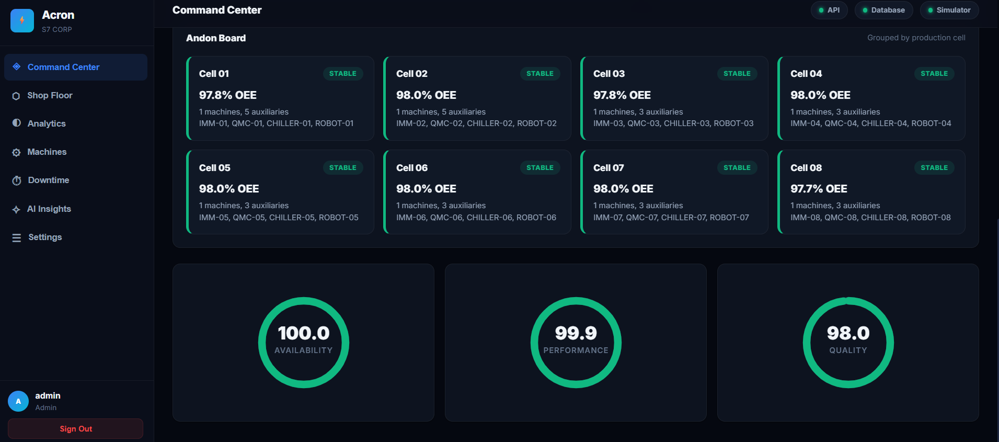
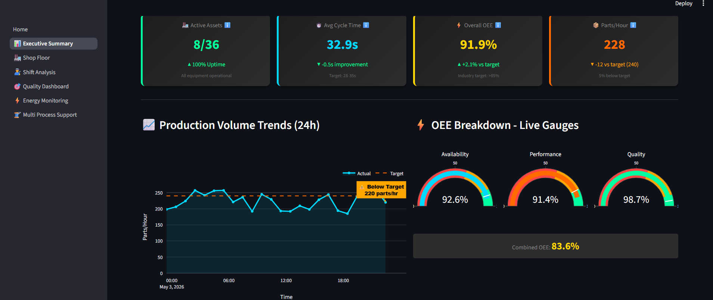
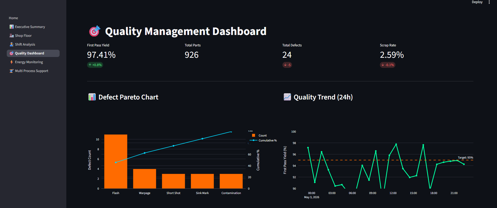
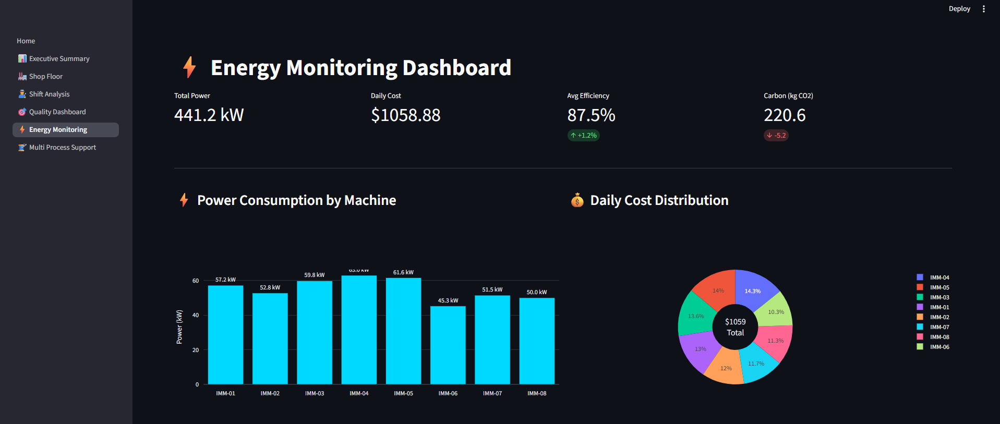

# Acron

**Intelligence meets reality.**

Acron is an industrial IoT intelligence platform from **S7 Corp** for injection molding and automotive component factories. It combines live machine telemetry, OEE analytics, AI-powered anomaly detection, predictive maintenance, and a premium dark-mode command center — built to scale from one production line to an entire plant network.

---

## Dashboard Previews









---

## Architecture

```
┌─────────────────────────────────────────────────────┐
│                    ACRON PLATFORM                    │
├─────────────────────┬───────────────────────────────┤
│   React SPA (Vite)  │     FastAPI Backend (v2)      │
│  ┌───────────────┐  │  ┌──────────┐ ┌───────────┐  │
│  │ Command Center│  │  │ REST API │ │ WebSocket │  │
│  │ Shop Floor    │  │  │ JWT/RBAC │ │ Telemetry │  │
│  │ Analytics     │  │  │ OEE Eng  │ │ Broadcast │  │
│  │ AI Insights   │  │  │ AI/ML    │ └───────────┘  │
│  │ Machines      │  │  │ Analytics│                 │
│  │ Downtime      │  │  └──────────┘                 │
│  └───────────────┘  │                               │
├─────────────────────┴───────────────────────────────┤
│               PostgreSQL / TimescaleDB              │
├─────────────────────────────────────────────────────┤
│          Edge Gateway (MC / Modbus / OPC UA)        │
└─────────────────────────────────────────────────────┘
```

## Features

### Core Platform
- **Real-time OEE** — Availability × Performance × Quality with loss-tree analysis
- **Live Andon Board** — Cell-level status tiles with color-coded health indicators
- **Machine Master** — Full factory hierarchy: Plant → Line → Cell → Machine → Process → Mold
- **Downtime Capture** — Operator-grade reason coding with resolution workflow
- **Role-Based Access** — Admin, Manager, Supervisor, Maintenance, Operator roles with JWT auth
- **Edge Connectors** — Mitsubishi MC Protocol, Modbus TCP, OPC UA, MQTT, Simulator

### AI Intelligence (V2)
- **Anomaly Detection** — Statistical z-score analysis on telemetry streams
- **Health Scoring** — Composite 0-100 score combining OEE, stability, and downtime
- **Predictive Insights** — Equipment risk identification and trend analysis

### Premium UI
- **Dark-mode-first** design with glassmorphism and gradient accents
- **Real-time WebSocket** telemetry updates
- **SVG OEE gauges** with animated transitions
- **Responsive layout** — desktop, tablet, and mobile breakpoints
- **Inter typography** from Google Fonts

## Quick Start

### Backend API

```bash
cd ingress-api
pip install -r requirements.txt
uvicorn app.main:app --reload --port 8000
```

### Frontend (React)

```bash
cd acron-ui
npm install
npm run dev
```

### Docker (Full Stack)

```bash
docker-compose up --build
```

**Open:**
- Dashboard: http://localhost:3000
- API Docs: http://localhost:8000/docs
- API Health: http://localhost:8000/health
- Legacy Dashboard: http://localhost:8501

## Demo Credentials

Use the **Launch Demo** buttons for passwordless role testing, or:

```
Username: admin
Password: admin123
```

## API Endpoints

| Endpoint | Method | Description |
|----------|--------|-------------|
| `/api/v1/health` | GET | Platform health checks |
| `/api/v1/auth/demo-login` | POST | Passwordless demo session |
| `/api/v1/telemetry/latest` | GET | Latest telemetry for all equipment |
| `/api/v1/factory/machines` | GET | Machine master data |
| `/api/v1/oee` | GET | OEE calculations with loss tree |
| `/api/v1/downtime` | POST | Log downtime event |
| `/api/v1/analytics/oee-trend` | GET | Hourly OEE trend |
| `/api/v1/analytics/downtime-summary` | GET | Downtime by category |
| `/api/v1/ai/anomalies` | GET | AI anomaly detection |
| `/api/v1/ai/health-scores` | GET | Equipment health scores |
| `/ws/andons` | WebSocket | Real-time telemetry stream |

## Tech Stack

| Layer | Technology |
|-------|-----------|
| Frontend | React 18, Vite, Vanilla CSS, Recharts |
| Backend | Python, FastAPI, SQLAlchemy, Pydantic |
| Database | PostgreSQL, TimescaleDB |
| Auth | JWT (python-jose), bcrypt (passlib) |
| AI/ML | Statistical analysis, z-score detection |
| Edge | MC Protocol, Modbus, OPC UA, MQTT |
| Deploy | Docker Compose, Render, Nginx |

## Deployment

### Render Cloud

```bash
# render.yaml provisions:
# - acron-postgres (free tier)
# - acron-api (Docker)
# - acron-dashboard (Docker)
```

### Docker Compose

Includes TimescaleDB, API, React dashboard, legacy Streamlit dashboard, and edge gateway.

## Roadmap

- [x] V1.0 — Real-time OEE, PLC integration, JWT auth, Docker
- [x] V2.0 — React SPA, AI anomaly detection, health scoring, analytics
- [ ] V3.0 — TechMate AI assistant, digital twin, mobile app, multi-tenant SaaS

## License

MIT. Commercial deployment terms available for production factory use.

---

**Acron** by **S7 Corp** — *Intelligence meets reality.*
