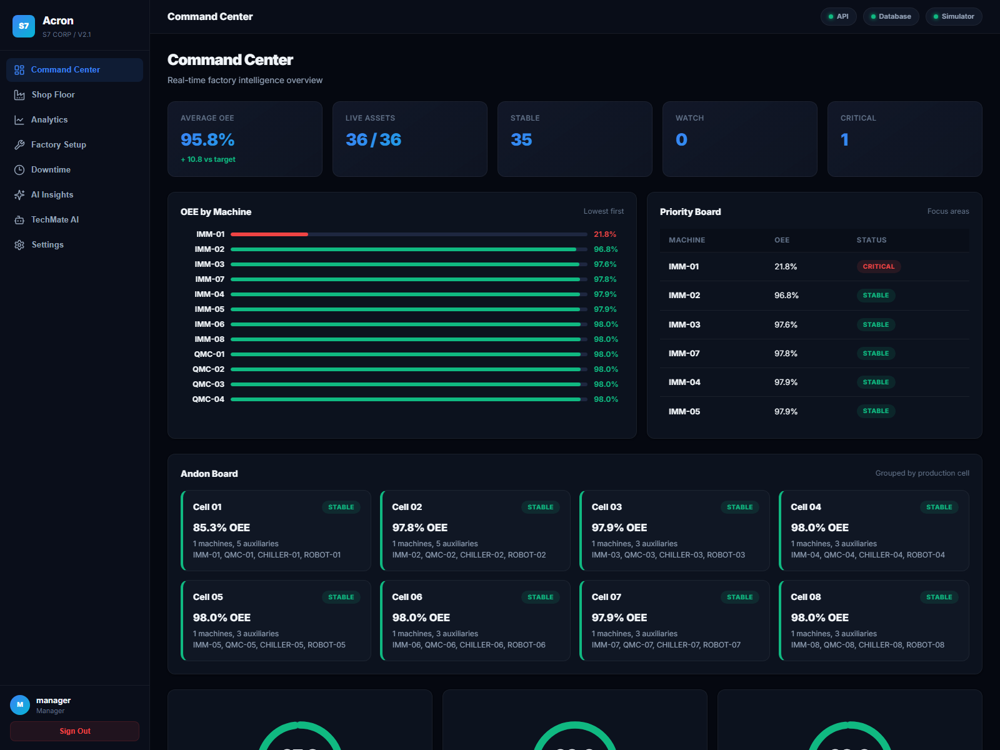
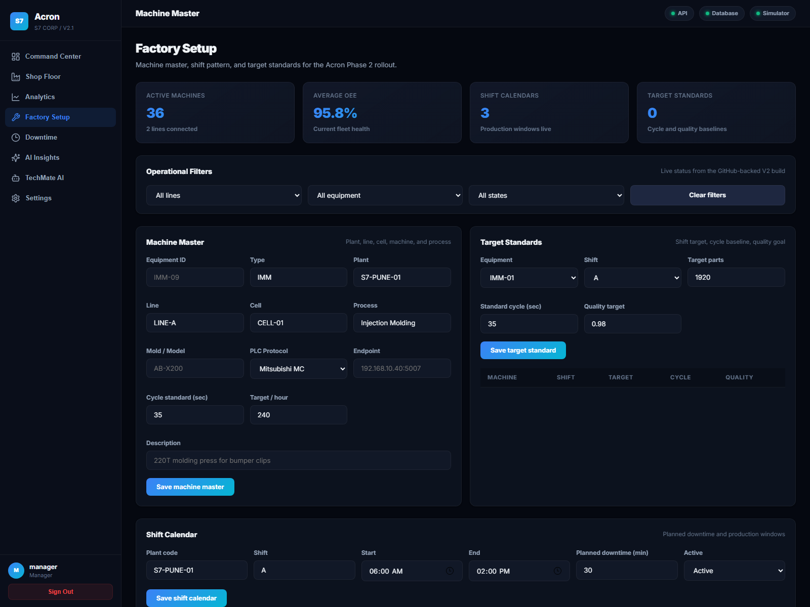
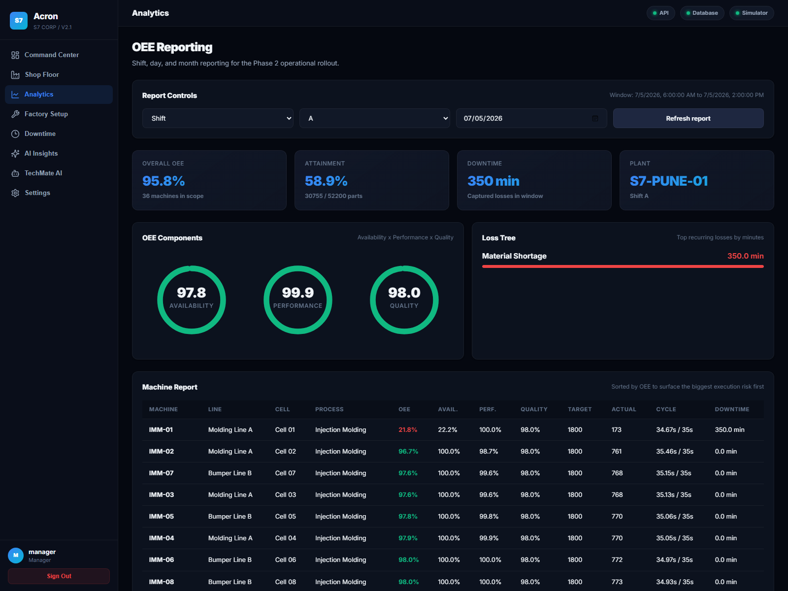
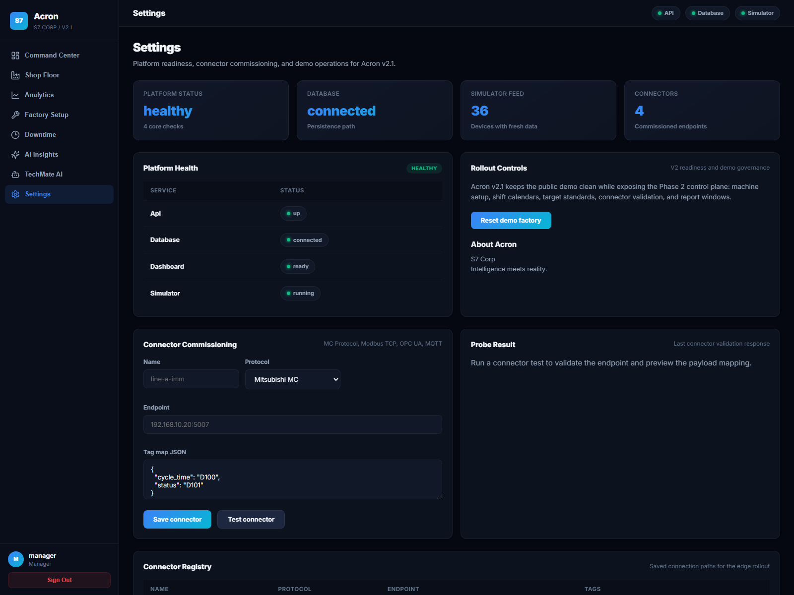

# Acron

**Intelligence meets reality.**

Acron is an industrial IoT intelligence platform from **S7 Corp** for injection molding and automotive component factories. It combines live machine telemetry, OEE analytics, downtime intelligence, connector commissioning, and AI-assisted operations in a modern plant command center.

---

## Live Demo Screens

Captured from the current Acron V2 demo build with simulated plant telemetry and role-based demo access.









---

## What Acron Covers

### Plant Operations
- Real-time OEE with availability, performance, and quality views
- Cell and line visibility through shop-floor and command-center dashboards
- Downtime capture with reason codes and operator notes
- Shift calendar management and target standard setup
- Factory hierarchy management: plant -> line -> cell -> machine -> process -> mold/model

### Industrial Connectivity
- Mitsubishi MC Protocol
- Modbus TCP
- OPC UA
- MQTT
- Simulator path for demos and pre-commissioning

### Intelligence Layer
- OEE reporting by shift, day, and month
- Loss-tree rollups by downtime category
- Equipment health scoring
- Anomaly detection on telemetry behavior
- Role-aware screens for operator, supervisor, maintenance, manager, and admin users

---

## Platform Architecture

```text
React SPA (Vite)
  -> Command Center
  -> Shop Floor
  -> OEE Reporting
  -> Factory Setup
  -> Downtime Capture
  -> AI Insights
  -> Settings / Connectors

FastAPI Backend
  -> JWT auth and demo mode
  -> Telemetry ingestion
  -> OEE engine and reporting
  -> Shift and target standards
  -> Connector configuration and probe APIs
  -> AI and analytics endpoints
  -> WebSocket telemetry broadcast

Data + Edge
  -> PostgreSQL / TimescaleDB path
  -> Edge gateway connectors for PLC and IIoT protocols
```

---

## Quick Start

### Backend

```bash
cd ingress-api
pip install -r requirements.txt
uvicorn app.main:app --reload --port 8000
```

### Frontend

```bash
cd acron-ui
npm install
npm run dev
```

### Open
- Frontend: http://localhost:4173
- API docs: http://localhost:8000/docs
- API health: http://localhost:8000/api/v1/health
- Legacy dashboard: http://localhost:8501

---

## Demo Access

Use the built-in demo role buttons on the login screen for passwordless access.

Default admin credentials are also available for local testing:

```text
Username: admin
Password: admin123
```

---

## Key API Endpoints

| Endpoint | Method | Purpose |
| --- | --- | --- |
| `/api/v1/health` | GET | Platform health checks |
| `/api/v1/auth/demo-login` | POST | Demo session launch |
| `/api/v1/telemetry/latest` | GET | Latest telemetry by asset |
| `/api/v1/factory/machines` | GET/POST | Machine master management |
| `/api/v1/factory/shift-calendars` | GET/POST | Shift calendar management |
| `/api/v1/factory/target-standards` | GET/POST | Target and cycle standard management |
| `/api/v1/oee` | GET | Base OEE calculations |
| `/api/v1/reports/oee` | GET | Shift/day/month OEE reporting |
| `/api/v1/downtime` | POST | Downtime event capture |
| `/api/v1/connectors` | GET/POST | Connector registry |
| `/api/v1/connectors/test` | POST | Connector probe test |
| `/api/v1/ai/anomalies` | GET | AI anomaly detection |
| `/api/v1/ai/health-scores` | GET | AI equipment health scoring |
| `/ws/andons` | WebSocket | Live telemetry stream |

---

## Tech Stack

| Layer | Technology |
| --- | --- |
| Frontend | React 18, Vite, Vanilla CSS, Lucide |
| Backend | Python, FastAPI, SQLAlchemy, Pydantic |
| Database | PostgreSQL, TimescaleDB path |
| Auth | JWT, demo mode, role-based access |
| Edge | MC Protocol, Modbus, OPC UA, MQTT |
| Deployment | Docker Compose, Render, Nginx |

---

## Current Rollout Status

- Phase 1 foundation in place for demo reliability
- Phase 2 V2 rollout includes factory setup, target standards, connector testing, and OEE reporting
- AI insight layer is active for anomaly and health views
- Demo UI is branded as **Acron by S7 Corp**

---

## License

MIT. Commercial deployment terms can be defined for production factory use.

---

**Acron** by **S7 Corp**